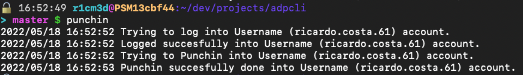

# adpcli
Nonofficial cli application that interacts with ADP Expert.

[](https://github.com/r1cm3d/adpcli/blob/master/LICENSE)

## Prerequisites
[](https://github.com/golang/go)

## Table of Contents
* [Prerequisites](#prerequisites)
* [Building](#building)
* [Installing](#installing)
* [Using](#using)
* [Tips](#tips)
* [Getting Help](#getting-help)

## Building
```
make build
```
It will call `go build` in order to download and build all dependencies.

## Installing
#### Standalone install
```
curl -sf https://goblin.reaper.im/github.com/r1cm3d/adpcli | sh
```

#### Installing by source 
```
export ADPCLI_BIN="$DEV/bin"; make
```
It requires `ADPCLI_BIN` environment variable that must be on `PATH` environment variable. The user must have permissions to
write in this directory.

## Using 
```
adpcli -u 'YOUR_ADP_USERNAME' -p 'YOUR_ADP_PASSWORD' punchin
```
It will punchin into ADP Expert application.

## Tips
It is worth to create an alias as follows:
```console
alias adpu='vaultgu "$VID_ADP"'
alias adpp='vaultgp "$VID_ADP"'
alias punchin='adpcli -u "$(adpu)" -p "$(adpp)" punchin'
```
Calling Punchin function:

## Getting Help

```console
./adpcli --help
```

Help information will be displayed:

```console

           _            _ _ 
  __ _  __| |_ __   ___| (_)
 / _ |/ _ | _ |  \ / __| | |
| (_| | (_| | |_) | (__| | |
 \__,_|\__,_| .__/ \___|_|_|
            |_|             
Interacts with ADP Expert application via command line.

Usage:
  adpcli [command]

Available Commands:
  completion  Generate the autocompletion script for the specified shell
  help        Help about any command
  punchin     Punch the clock

Flags:
  -h, --help              help for adpcli
  -p, --password string   The password of ADP Expert application.
  -u, --username string   The username of ADP Expert application.

Use "adpcli [command] --help" for more information about a command.
```
## Acknowledgments
Thanks @mniak for create [adpexpert](https://github.com/mniak/adpexpert) library.
